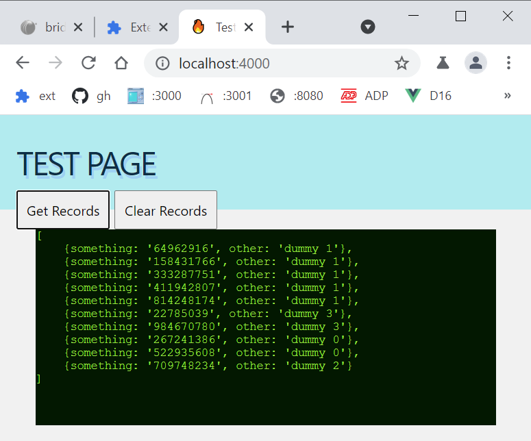

#### About

Node.js test with spawning child processes and a control panel via a web interface.



#### Run

```y server``` and then ```start localhost:4000``` or run Live Server on ```localhost:5500/index.html``` (CORS are supported).

#### References and Credits

[FrontendMasters - Digging Into Node.js](https://frontendmasters.com/courses/digging-into-node/)

